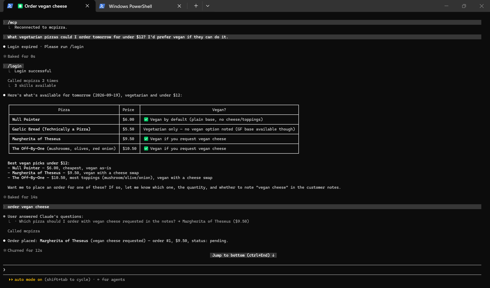

# django-mcpz



*Easy peasy MCP servers in Django.*

django-mcpz lets you build a Model Context Protocol (MCP) server in your Django project.
Create an MCP server object with metadata, give it a URL, and attach Python functions to it as tools.
The MCP server acts like a regular synchronous Django view, handling the intricacies of the MCP protocol.
django-mcpz leans on [msgspec](https://msgspec.dev/) for defining schemas and fast JSON serialization and deserialization.

A quick example:

```python

from typing import Literal

import msgspec

from django_mcpz.server import MCPServer
from django_mcpz.bearer_tokens.auth import token_auth
from example.models import Order

server = MCPServer(
    name="shop",
    version="1.0.0",
    instructions="Query the shop’s order database.",
    auth=token_auth,
)


class CountOrdersParams(msgspec.Struct):
    status: Literal["pending", "shipped", "cancelled"] | None = None


class CountOrdersResult(msgspec.Struct):
    count: int


@server.tool(
    description="Count Order rows, optionally filtered by status.",
    read_only=True,
)
def count_orders(request, params: CountOrdersParams) -> CountOrdersResult:
    qs = Order.objects.all()
    if params.status is not None:
        qs = qs.filter(status=params.status)
    return CountOrdersResult(count=qs.count())
```

## Django MCPZ - MCPizza Example App

This package provides a complete implementation of the **MCPizza** example server using **django-mcpz**.

### Quick Start

1. **Install dependencies:**
    ```bash
    python3 -m venv venv
    source venv/bin/activate
    pip install -r requirements.txt
    ```

2. **Run migrations:**
    ```bash
    python manage.py makemigrations example
    python manage.py migrate
    ```

3. **Create superuser & bearer token:**
    ```bash
    python manage.py createsuperuser --username admin --email admin@example.com
    python manage.py mcpz bearer-tokens create "Claude Code" --user admin
    ```
    Update the generated token in the [example/mcp.json](example/mcp.json) file.

4. **Seed database:**
    ```bash
    python seed_data.py
    ```

5. **Start server:**
    ```bash
    python manage.py runserver 127.0.0.1:8000
    ```
Your MCP server is now serving at [http://127.0.0.1:8000/mcp](http://127.0.0.1:8000/mcp).

## Connecting and Testing with MCP Clients

### Option A: Claude Code, Cursor, or Zed

Edit mcp.json and insert your token:

```json
{
  "mcpServers": {
    "mcpizza": {
      "type": "http",
      "url": "http://127.0.0.1:8000/mcp",
      "headers": {
        "Authorization": "Bearer <YOUR_GENERATED_BEARER_TOKEN>"
      }
    }
  }
}
```

Run queries via Claude Code:

```bash
claude --mcp-config mcp.json --strict-mcp-config --allowedTools "mcp__mcpizza__*" \
  -p "What vegetarian pizzas could I order tomorrow for under $12? I'd prefer vegan if they can do it."
```

### Option B: Direct HTTP Verification with cURL

Because the endpoint operates statelessly via JSON-RPC 2.0 over HTTP POST:

```bash
curl -X POST http://127.0.0.1:8000/mcp \
  -H "Authorization: Bearer <YOUR_GENERATED_BEARER_TOKEN>" \
  -H "Content-Type: application/json" \
  -d '{
    "jsonrpc": "2.0",
    "id": 1,
    "method": "tools/call",
    "params": {
      "name": "search_menu",
      "arguments": {
        "max_price": 12.0,
        "vegetarian_only": true
      }
    }
  }'
```

## Documentation

Please see https://django-mcpz.readthedocs.io/.
